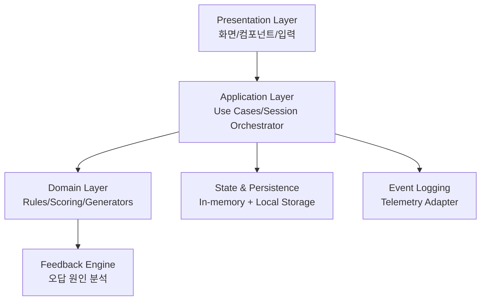
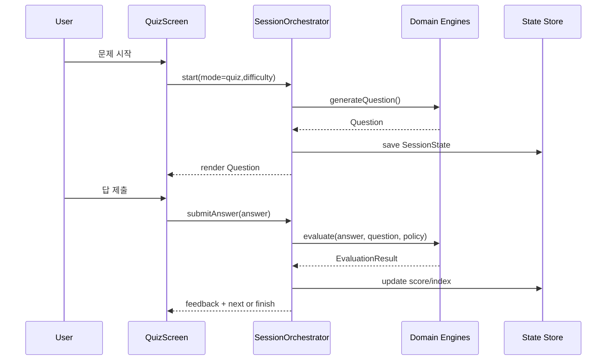

# TIME MASTER - Architecture Document

## 1. 문서 목적
이 문서는 TIME MASTER MVP 구현을 위한 기술 아키텍처를 정의한다.

목표:
- 기능 요구사항(FR-01 ~ FR-11)을 안정적으로 구현
- 모드별 로직을 재사용 가능한 엔진으로 분리
- 추후 확장(Post-MVP)을 고려한 구조 설계

참조 문서:
- IDEATION.md
- PRD.md

---

## 2. 아키텍처 원칙
- 단일 책임: UI, 도메인 로직, 상태 저장, 분석 로깅을 분리한다.
- 결정적 채점: 동일 입력에는 항상 동일 결과를 반환한다.
- 규칙 중심 설계: 난이도/문제유형/보상 규칙을 코드 하드코딩이 아닌 정책 객체로 관리한다.
- 확장 용이성: 문제 유형, 스킨, 도전과제를 추가해도 기존 코어를 수정 최소화한다.
- 사용자 피드백 우선: 오답 즉시 분석과 설명 생성 경로를 핵심 플로우로 둔다.

---

## 3. 시스템 컨텍스트
TIME MASTER는 클라이언트 중심 앱으로 동작한다.

외부 의존:
- 시스템 시간 소스: 메인화면 실시간 시계 동기화
- 로컬 저장소: 진행 상태, 스킨, 도전과제, 설정 저장

초기 MVP에서는 서버 의존 없이 로컬 우선으로 설계한다.

---

## 4. 상위 구조

레이어 설명:
- Presentation Layer: 메인/공부하기/문제풀기/타임어택/결과/스킨 UI
- Application Layer: 모드 시작/진행/종료 시나리오 오케스트레이션
- Domain Layer: 시간 생성, 채점, 난이도 정책, 도전과제 판정
- State & Persistence: 세션 상태와 영구 상태 관리
- Event Logging: 사용자 행동 이벤트 기록

---

## 5. 모듈 설계

## 5.1 Presentation 모듈
주요 화면:
- MainScreen: 실시간 아날로그 시계, 모드 진입
- StudyScreen: 랜덤 시간 시계 + 단계형 설명
- QuizScreen: 20문제 평가 흐름
- TimeAttackScreen: 60초 제한 문제 흐름
- ResultScreen: 점수/정답 수/오답 요약
- SkinScreen: 보유 스킨 목록/장착

주요 UI 컴포넌트:
- AnalogClockView
- DigitalTimeView
- TimeInputForm (시/분/초 분리 입력)
- HandDragController (시침/분침/초침 드래그)
- DifficultySelector
- ChallengeToast

## 5.2 Application 모듈
Use Case:
- StartModeUseCase
- GenerateQuestionUseCase
- SubmitAnswerUseCase
- EvaluateChallengeUseCase
- CompleteModeUseCase
- EquipSkinUseCase

Orchestrator:
- SessionOrchestrator
  - 현재 모드, 난이도, 문제 인덱스, 타이머, 점수 상태를 조정

## 5.3 Domain 모듈
Core Engine:
- TimeGenerationEngine
- ClockScoringEngine
- FeedbackEngine
- ChallengeEngine
- SkinRuleEngine

Policy 객체:
- DifficultyPolicy (Easy/Normal/Hard)
- QuestionTypePolicy (TypeA/TypeB)
- ModePolicy (Study/Quiz/TimeAttack)

## 5.4 Persistence 모듈
저장 단위:
- UserProgressRepository
- SessionRepository
- SkinRepository
- ChallengeRepository

저장 전략:
- 실행 중 상태: 메모리 상태 저장소
- 영구 상태: 로컬 저장소(JSON 직렬화)

## 5.5 Analytics 모듈
- EventBus
- TelemetryAdapter
- EventSchemaValidator

PRD 이벤트와 매핑:
- mode_entered
- question_generated
- answer_submitted
- feedback_shown
- mode_completed
- challenge_unlocked
- skin_equipped

---

## 6. 핵심 도메인 모델

## 6.1 시간 모델
TimePoint:
- hour: int
- minute: int
- second: int
- period: AM | PM (Hard에서는 hour24로 해석)
- hour24: int (0~23, Hard 모드 우선)

ClockHandState:
- hourAngle
- minuteAngle
- secondAngle

## 6.2 문제 모델
Question:
- id
- mode: quiz | timeAttack
- difficulty: easy | normal | hard
- type: inputFromClock | setClockFromTime
- promptTime: TimePoint
- expectedClockState: ClockHandState
- metadata: 난이도/피드백 힌트

Answer:
- typeAInput: { hour, minute, second?, hour24? }
- typeBInput: { hourAngle, minuteAngle, secondAngle }

EvaluationResult:
- isCorrect
- scoreDelta
- handResult: { hour, minute, second }
- errorCategories: string[]
- feedbackMessages: string[]

## 6.3 진행 상태 모델
SessionState:
- mode
- difficulty
- questionIndex
- totalQuestions (quiz=20)
- remainingSeconds (timeAttack=60)
- score
- correctCount
- startedAt

UserProgress:
- totalAttempts
- avgScore
- timeAttackBest
- quizPerfectStreak

ChallengeState:
- challengeId
- achieved
- achievedAt

SkinInventory:
- skinId
- owned
- equipped

---

## 7. 채점 및 판정 아키텍처

## 7.1 공통 채점 흐름
1. 입력 정규화
2. 난이도 정책 적용
3. 문제 유형별 채점
4. 오답 카테고리 분류
5. 피드백 메시지 생성
6. 점수 및 통계 갱신

## 7.2 유형 A 채점 (시계 -> 시간 입력)
- 정답 TimePoint와 사용자 입력 비교
- Easy: second 비교 제외
- Normal: hour/minute/second 모두 비교
- Hard: 24시간 기준 비교 + AM/PM 표시 규칙 반영

## 7.3 유형 B 채점 (시간 -> 시계 조정)
- 각 바늘 각도를 눈금 좌표로 변환
- 시/분/초 독립 채점
- 허용 오차: 0.5 눈금

눈금 환산 개념:
- minuteTick = angle / 6
- secondTick = angle / 6
- hourTick = angle / 30 (분 반영 가능)

판정 함수 예시:
- abs(userTick - expectedTick) <= 0.5 => 정답

## 7.4 오답 분석 엔진
ErrorCategory 예시:
- MINUTE_READING_ERROR
- SECOND_IGNORED_ERROR
- AM_PM_COLOR_MISREAD
- HOUR_24_FORMAT_ERROR
- HAND_ALIGNMENT_ERROR

카테고리 -> 피드백 메시지 템플릿 매핑으로 설명 생성.

---

## 8. 난이도/출제 엔진 설계

## 8.1 출제 규칙
- Easy
  - second = 0
  - 초침 12시 고정
- Normal
  - hour/minute/second 랜덤
- Hard
  - hour24 기반 랜덤
  - AM/PM 색상 인디케이터 표시

## 8.2 공통 제약
- 문제풀기/타임어택에서는 초침이 항상 정수 초 눈금을 가리킴
- 즉, second는 0~59 정수만 사용하며 소수 각도 없음

## 8.3 문제 유형 비율
MVP 기본값:
- TypeA 50%
- TypeB 50%

확장 가능:
- Difficulty별 가중치 테이블 지원

---

## 9. 모드별 시퀀스

## 9.1 문제풀기 시퀀스

## 9.2 타임어택 시퀀스
- quiz 시퀀스와 유사하나 타이머 인터럽트가 우선 종료 조건
- remainingSeconds == 0 이면 즉시 CompleteModeUseCase 호출

## 9.3 공부하기 시퀀스
- 랜덤 시간 제시
- 단계형 설명 진행
- 체류 시간 누적
- 30분 조건 달성 시 ChallengeEngine 호출

---

## 10. 상태 관리 전략
상태 구분:
- UI 상태: 현재 입력값, 드래그 중 핸들 상태
- 세션 상태: 모드 진행, 점수, 타이머
- 영구 상태: 스킨/도전과제/누적 통계

권장 방식:
- 단일 상태 저장소(Store) + 이벤트 기반 업데이트
- 모드 종료 시점마다 영구 상태 동기화
- 앱 종료 이벤트에서 세이프 세이브

동시성/정합성:
- 타임어택 제출과 타이머 만료 충돌 방지
  - 타임스탬프 기반 우선순위 규칙 적용
  - 만료 이후 제출은 무효 처리

---

## 11. 영속성 설계
저장 키 예시:
- tm.userProgress
- tm.challengeState
- tm.skinInventory
- tm.settings

직렬화 원칙:
- 버전 필드 포함: schemaVersion
- 호환성: 알 수 없는 필드는 무시
- 손상 복구: 파싱 실패 시 기본값으로 복원

---

## 12. 스킨/도전과제 아키텍처

## 12.1 도전과제 판정 트리거
- mode_completed 이벤트 수신
- ChallengeEngine에서 조건 검사
- 미달성 -> 달성 전환 시 보상 지급

## 12.2 1회성 보장
- ChallengeState.achieved == true이면 재지급 금지
- 보상 지급은 트랜잭션 형태로 처리:
  1) 챌린지 달성 표시
  2) 스킨 소유 상태 업데이트
  3) 이벤트 기록

## 12.3 스킨 적용
- equipped skinId를 단일 값으로 관리
- 화면 렌더러는 현재 equipped 스킨 테마를 참조

---

## 13. 오류 처리 전략
오류 분류:
- Recoverable: 저장소 읽기 실패, 일부 이벤트 로깅 실패
- Fatal: 상태 손상으로 진행 불가

대응:
- Recoverable: 기본값 복구 + 사용자 알림 최소화
- Fatal: 안전 종료 화면 + 초기화 옵션 제공

입력 검증:
- 숫자 범위 검증
  - 시: 0~23 또는 1~12(문맥별)
  - 분/초: 0~59
- 유효하지 않은 입력 제출 차단

---

## 14. 성능 아키텍처
성능 목표(PRD 연계):
- 화면 전환 1초 이내
- 채점 응답 300ms 이내

최적화 포인트:
- 각도/눈금 변환 유틸 캐시
- 재렌더링 최소화(바늘 컴포넌트 분리)
- 타이머 업데이트 스로틀링(렌더와 로직 분리)

---

## 15. 테스트 아키텍처
테스트 레이어:
- Unit Test
  - TimeGenerationEngine
  - ClockScoringEngine
  - FeedbackEngine
  - ChallengeEngine
- Integration Test
  - SessionOrchestrator + Repository
- UI Test
  - 모드 시작/제출/결과 흐름
  - 드래그 조작 및 오차 판정

핵심 테스트 데이터:
- 경계 시간: 00:00:00, 11:59:59, 12:00:00, 23:59:59
- 오차 경계: 정확히 0.5 눈금
- 타임어택 종료 직전 제출

---

## 16. 보안/프라이버시 고려
MVP 원칙:
- PII(개인식별정보) 수집 없음
- 로컬 학습 데이터만 저장
- 분석 이벤트는 익명 통계 중심

---

## 17. 확장 포인트 (Post-MVP 준비)
- 오답 노트 자동 생성기: ErrorCategory 히스토리 기반
- 개인화 추천 엔진: 약점 개념 우선 출제
- 랭킹 시스템: 서버 동기화 레이어 추가
- 스킨 이펙트 시스템: 테마 + 애니메이션 플러그인 구조

---

## 18. 구현 우선순위
1. Domain 코어 완성 (생성/채점/피드백)
2. Quiz/TimeAttack 오케스트레이션
3. Study 플로우 + 체류 측정
4. 스킨/도전과제 연동
5. 이벤트 로깅/테스트 강화

이 순서를 따르면 채점 신뢰성과 모드 완성도를 먼저 확보할 수 있다.
