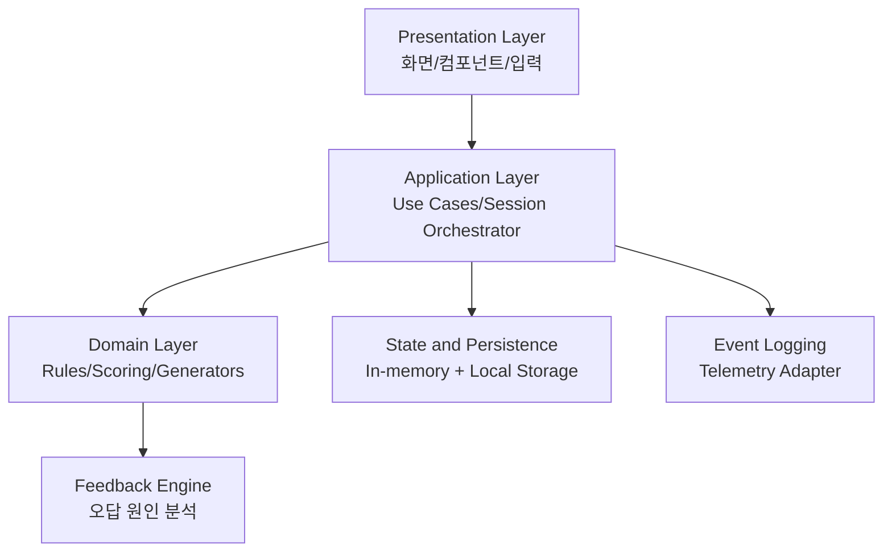
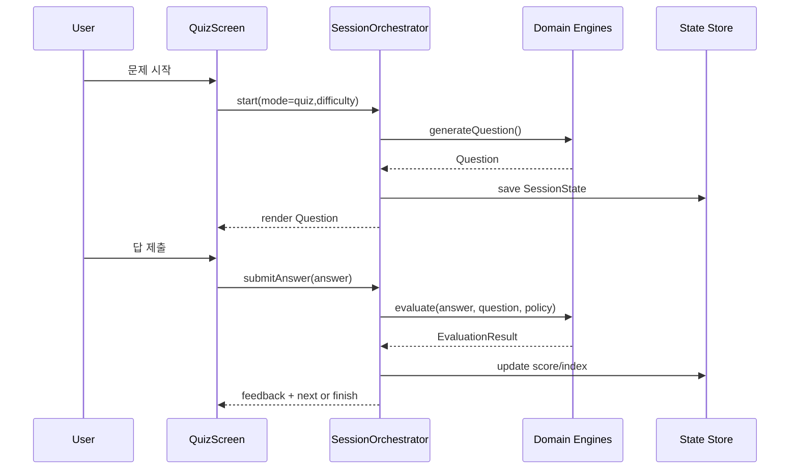

# TIME MASTER - Technical Requirements Document (TRD)

## 1. 문서 정보
- 문서명: TRD (Technical Requirements Document)
- 제품명: TIME MASTER
- 버전: v1.0
- 작성일: 2026-08-08
- 기반 문서:
	- PRD.md
- 통합 이력 문서(본 TRD로 병합 후 제거):
	- IDEATION.md
	- ARCHITECTURE.md
	- idea.txt
- 대상 릴리스: MVP

---

## 2. 목적과 범위
이 문서는 TIME MASTER MVP를 실제 구현 가능한 수준으로 구체화한 기술 요구사항 문서다.

목적:
- PRD의 기능 요구사항(FR-01 ~ FR-11)을 개발 단위로 분해
- ARCHITECTURE의 모듈 경계를 코드 레벨 계약으로 명시
- 테스트, 성능, 데이터 저장, 릴리스 기준을 엔지니어링 관점에서 확정

MVP 범위:
- 메인 실시간 시계
- 공부하기, 문제풀기, 타임어택
- 난이도 3단계, 문제 유형 2종
- 오답 분석 피드백
- 스킨/도전과제(1회성)
- 로컬 저장, 로컬 이벤트 로깅

비범위:
- 클라우드 동기화
- 서버 기반 랭킹
- 결제/광고

---

## 3. 시스템 개요

### 3.1 실행 모델
- 클라이언트 단독 실행
- 시스템 시간 사용(메인화면)
- 로컬 저장소 기반 상태 영속화

### 3.2 모드별 시간 소스
- 메인화면: 시스템 현재 시간 실시간 동기화
- 공부하기: 랜덤 시간 생성기
- 문제풀기: 랜덤 시간 생성기
- 타임어택: 랜덤 시간 생성기

### 3.3 핵심 정책
- 결정적 채점: 동일 문제/입력은 항상 동일 결과
- 정책 기반 난이도: Easy/Normal/Hard를 테이블로 관리
- 1회성 보상: 도전과제 보상은 로컬 사용자 데이터 기준 1회만 지급

---

## 4. 기술 아키텍처 요구사항

### 4.1 레이어 구조
1. Presentation Layer
- 화면 렌더링, 사용자 입력, 드래그 제어

2. Application Layer
- 세션 오케스트레이션, 모드 라이프사이클 제어

3. Domain Layer
- 시간 생성, 채점, 피드백, 도전과제 판정

4. Persistence Layer
- 로컬 영속 저장, 스키마 버전 관리, 복구

5. Analytics Layer
- 이벤트 수집/검증/저장

### 4.2 모듈 책임
- AnalogClockView: 시계 UI 렌더링
- TimeInputForm: 시/분/초 입력 처리
- HandDragController: 시침/분침/초침 드래그
- SessionOrchestrator: 모드 흐름 제어
- TimeGenerationEngine: 난이도 조건 시간 생성
- ClockScoringEngine: 유형 A/B 채점
- FeedbackEngine: 오답 카테고리 및 메시지 생성
- ChallengeEngine: 도전과제 달성/보상 판정
- Repository 계층: 저장/조회/업데이트

---

## 5. 도메인 기술 명세

## 5.1 데이터 모델

### TimePoint
- hour24: 0~23
- minute: 0~59
- second: 0~59
- period: AM | PM (표시용 파생값)

### ClockHandState
- hourAngle: 0 <= x < 360
- minuteAngle: 0 <= x < 360
- secondAngle: 0 <= x < 360

### Question
- id: string
- mode: quiz | timeAttack
- difficulty: easy | normal | hard
- type: inputFromClock | setClockFromTime
- promptTime: TimePoint
- expectedClockState: ClockHandState

### EvaluationResult
- isCorrect: boolean
- scoreDelta: number
- handResult: { hour: boolean, minute: boolean, second: boolean }
- errorCategories: string[]
- feedbackMessages: string[]

### SessionState
- mode
- difficulty
- questionIndex
- totalQuestions
- remainingSeconds
- score
- correctCount
- startedAt

### UserPersistentState
- userProgress
- challengeState
- skinInventory
- settings
- schemaVersion

---

## 5.2 난이도 정책

### Easy
- second = 0 고정
- 초침 12시 방향
- 유형 A에서 초 입력 없음(입력 UI 비활성 또는 숨김)

### Normal
- hour/minute/second 랜덤
- 유형 A에서 초 입력 필수

### Hard
- hour24 기준 입력
- AM/PM 시각 힌트 표시(파랑=오전, 빨강=오후)
- 예: 오후 9시 -> 21시 입력

공통 규칙:
- 문제풀기/타임어택에서는 초침이 항상 눈금을 정확히 가리키도록 생성

---

## 5.3 문제 유형 정책

### 유형 A: 시계 보고 시간 입력
- 입력 필드: 시/분/초
- Easy는 초 입력 비활성
- 판정:
	- Easy: hour, minute 비교
	- Normal: hour, minute, second 비교
	- Hard: hour24, minute, second 비교

### 유형 B: 시간 보고 시계 맞추기
- 시침/분침/초침 개별 드래그
- 각 바늘 독립 판정
- 허용 오차: 0.5 눈금

눈금 변환:
- minuteTick = minuteAngle / 6
- secondTick = secondAngle / 6
- hourTick = hourAngle / 30

판정식:
- abs(userTick - expectedTick) <= 0.5

---

## 5.4 점수 정책
- 문제풀기: 총 20문제, 문제당 5점, 최대 100점
- 타임어택: 점수 대신 정답 개수 집계
- 유형 B 채점 반영:
	- 기본 정책: 3개 바늘 모두 정답이면 해당 문제 정답
	- 부분 정답 데이터는 결과 요약 및 피드백에만 사용

---

## 5.5 오답 분석 정책

오답 카테고리:
- MINUTE_READING_ERROR
- SECOND_IGNORED_ERROR
- AM_PM_COLOR_MISREAD
- HOUR_24_FORMAT_ERROR
- HAND_ALIGNMENT_ERROR

규칙:
- 최소 1개 이상 카테고리 반환
- 카테고리별 템플릿 문구 매핑
- 동일 오답 반복 시 우선 메시지 강화 가능(확장)

---

## 5.6 도전과제/스킨 정책

도전과제(1회성):
1. 타임어택 정답 20개 초과 -> 번개 스킨
2. 문제풀기 100점 연속 3회 -> 시험지 스킨
3. 문제풀기 0점 -> 부서진 스킨
4. 공부하기 30분 연속 체류 -> 학사모 스킨

원자성 보장 순서:
1. challenge achieved=true
2. skin owned=true
3. challenge_unlocked 이벤트 기록

중복 보상 정책:
- achieved=true 상태의 도전과제는 재지급 불가

---

## 6. 애플리케이션 플로우 요구사항

## 6.1 문제풀기
1. start(mode=quiz, difficulty)
2. generateQuestion
3. 사용자 제출
4. evaluate
5. 피드백 표시
6. 20문제 완료 시 결과 화면

결과 화면 필수 항목:
- 총점
- 정답 수
- 오답 수
- 주요 오답 유형

## 6.2 타임어택
1. start(mode=timeAttack, difficulty)
2. 60초 타이머 시작
3. 반복 출제/제출/판정
4. remainingSeconds=0 즉시 종료

결과 화면 필수 항목:
- 정답 개수
- 평균 반응시간(선택)

## 6.3 공부하기
1. 랜덤 시간 제시
2. 시침 -> 분침 -> 초침 -> 오전/오후 설명
3. 연속 체류 시간 누적
4. 30분 조건 충족 시 도전과제 판정

---

## 7. 저장소 및 상태 관리 요구사항

### 7.1 저장 키
- tm.userProgress
- tm.challengeState
- tm.skinInventory
- tm.settings

### 7.2 직렬화 규칙
- schemaVersion 필수
- 알 수 없는 필드는 무시
- 파싱 실패 시 기본값 복구

### 7.3 상태 동기화 시점
- 문제 제출 직후(세션 상태)
- 모드 완료 시(영구 상태)
- 앱 종료 시 세이프 세이브

### 7.4 충돌 규칙
- 타임어택 만료 이후 제출은 무효
- 제출 타임스탬프와 만료 타임스탬프 비교로 판정

---

## 8. 인터페이스 계약

## 8.1 Domain Service Interface (개념)

GenerateQuestionInput:
- mode
- difficulty
- type

GenerateQuestionOutput:
- question

EvaluateAnswerInput:
- question
- answer
- difficultyPolicy

EvaluateAnswerOutput:
- evaluationResult

EvaluateChallengeInput:
- completedSession
- previousProgress

EvaluateChallengeOutput:
- unlockedChallenges[]
- grantedSkins[]

## 8.2 Repository Interface (개념)
- loadUserProgress()
- saveUserProgress(progress)
- loadChallengeState()
- saveChallengeState(state)
- loadSkinInventory()
- saveSkinInventory(inventory)
- loadSettings()/saveSettings()

---

## 9. 이벤트 로깅 기술 요구사항

필수 이벤트:
- mode_entered(mode)
- question_generated(mode, difficulty, type)
- answer_submitted(correct, latencyMs)
- feedback_shown(category)
- mode_completed(result)
- challenge_unlocked(challengeId)
- skin_equipped(skinId)

요구사항:
- 이벤트 스키마 검증 후 저장
- 세션 단위 식별자 포함
- PII 저장 금지

---

## 10. 비기능 기술 요구사항

성능:
- 화면 전환 1초 이내
- 채점 응답 300ms 이내

안정성:
- 포커스 전환 시 세션 상태 보존
- 저장 실패 복구 경로 제공

사용성:
- 초등 학습자 기준 단순 UX
- 핵심 동작 3단계 이내

접근성:
- AM/PM 색상은 텍스트 병행
- 마우스/터치 동시 지원

---

## 11. 테스트 요구사항

## 11.1 단위 테스트
- TimeGenerationEngine
- ClockScoringEngine
- FeedbackEngine
- ChallengeEngine

## 11.2 통합 테스트
- SessionOrchestrator + Repository
- 도전과제 달성 후 스킨 지급 원자성

## 11.3 UI 테스트
- 모드 시작/제출/결과 흐름
- 드래그 조작 및 0.5 눈금 오차 판정

## 11.4 경계값 테스트
- 00:00:00
- 11:59:59
- 12:00:00
- 23:59:59
- 타임어택 종료 직전 제출

---

## 12. 요구사항 추적 매트릭스

FR-01 -> MainScreen, AnalogClockView, SystemClockAdapter

FR-02 -> TimeGenerationEngine, DifficultyPolicy

FR-03 -> StudyScreen, StudyFlowController, SessionTimer

FR-04 -> TimeInputForm, ClockScoringEngine(TypeA)

FR-05 -> HandDragController, ClockScoringEngine(TypeB)

FR-06 -> QuizScreen, SessionOrchestrator, ResultAssembler

FR-07 -> TimeAttackScreen, CountdownTimer, SessionOrchestrator

FR-08 -> FeedbackEngine, FeedbackTemplateRegistry

FR-09 -> DifficultyPolicy, UI Rule Binder

FR-10 -> SkinRepository, ThemeApplier

FR-11 -> ChallengeEngine, RewardTransaction

---

## 13. 구현 우선순위
1. Domain Core(시간 생성/채점/피드백)
2. Quiz/TimeAttack 플로우
3. Study 플로우 + 체류 측정
4. 스킨/도전과제
5. 로깅/테스트/최적화

---

## 14. 완료 기준 (DoD)
- FR-01 ~ FR-11 수용 기준 전부 충족
- High 심각도 결함 0건
- 경계값/회귀 테스트 통과
- 성능 목표 충족
- 데이터 손상 복구 시나리오 검증 완료

---

## 15. 오픈 이슈 (결정 필요)
1. Hard 모드에서 AM/PM 색상 힌트를 유지할지 여부
2. 유형 B 부분정답을 점수에 반영할지 여부
3. 타임어택 문제 유형 비율(기본 50:50 유지 여부)
4. 공부하기 30분 조건의 포그라운드 판정 기준 상세화

이 오픈 이슈는 MVP 구현 시작 전 확정이 권장된다.

---

## 16. 통합 부록 (삭제 문서 반영)

### 16.1 제품 핵심 가치
- 아날로그 시계를 직관적으로 읽는 능력 강화
- 시/분/초 개념의 단계적 이해
- AM/PM 및 24시간 표기 이해 강화
- 게임형 반복 학습을 통한 몰입도 향상

### 16.2 아키텍처 상위 구조

### 16.3 대표 시퀀스 (문제풀이)

### 16.4 MVP 구현 체크리스트
- 메인화면 실시간 시계 렌더링
- 난이도 반영 랜덤 시간 생성기
- 공부하기 튜토리얼 흐름
- 문제 유형 A/B UI 및 채점
- 문제풀기 20문제 점수 계산
- 타임어택 60초 정답 집계
- 오답 원인 분석 피드백
- 스킨 적용 시스템
- 1회성 도전과제 달성 및 보상

### 16.5 확장 백로그 (Post-MVP)
- 오답 노트 자동 생성
- 약점 기반 개인화 추천
- 일일 미션 및 주간 랭킹
- 스킨 희귀도 및 애니메이션 확장
